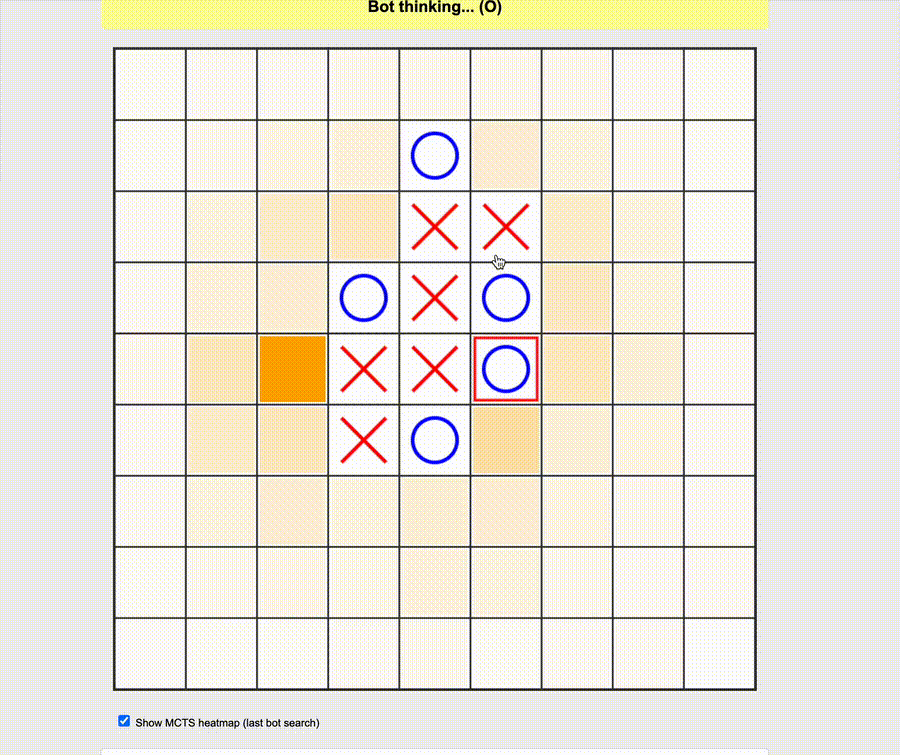

# AlphaZero Agent

AlphaZero-style reinforcement learning for board games. Learns through MCTS-guided self-play with a dual-head neural network (policy + value).

- [](tictactoe/tictactoe-demo.mp4)
- [Research Paper](nitzan_saar_research.pdf)

Supports:
- Connect Five (9x9 board)
- Go (9x9, and 19x19)

## Connect Five (TicTacToe)

```bash
cd tictactoe

# Training
./train.sh

# Play against bot
python play_human_vs_bot_flask.py

# Testing
python test_vs_random.py
python test_bot_vs_bot.py
```

### Play TicTacToe Against the Bot with Docker

You can play TicTacToe against the trained bot from a public Docker image,
without cloning this repository:

```bash
docker run --rm -p 5001:5001 nitzansaar/alphazero-tictactoe:latest
```

Open http://localhost:5001 in your browser.

This requires Docker Desktop or Docker Engine to be installed and running. The
first run may take a few minutes while Docker downloads the image.

To build the image locally instead, run this from the repository root:

```bash
docker build -t alphazero-tictactoe .
docker run --rm -p 5001:5001 alphazero-tictactoe
```

## Go

```bash
cd go

# Run selfplay training loop (defaults to 19x19)
bash train.sh

# Override board size
BOARD_SIZE=9 bash train.sh

# Play against bot
BOARD_SIZE=19 python3 play_human_vs_bot.py

# Test bot vs bot
BOARD_SIZE=19 python3 test_bot_vs_bot.py --model1 10 --model2 37

# Test AlphaZero vs KataGo (19x19, 100-game match)
bash run_az20_vs_katago_100.sh
# Override settings: AZ_ITERATION=146 KATAGO_ELO=482 KATAGO_VISITS=10 bash run_az20_vs_katago_100.sh

# Test KataGo vs AlphaZero (9x9)
BOARD_SIZE=9 python3 katago_vs_alphazero.py --az-iter 142 --katago-iter 10 --games 100

# Analyze a board position (NN policy/value + MCTS distribution)
BOARD_SIZE=19 python analyze_board.py --model models_19x19/10_best_model.pt --sims 800

# Interactive 19x19 match runner and move-by-move replay visualizer.
go/notebooks/az20_vs_pretrained_katago_19x19.ipynb
```

